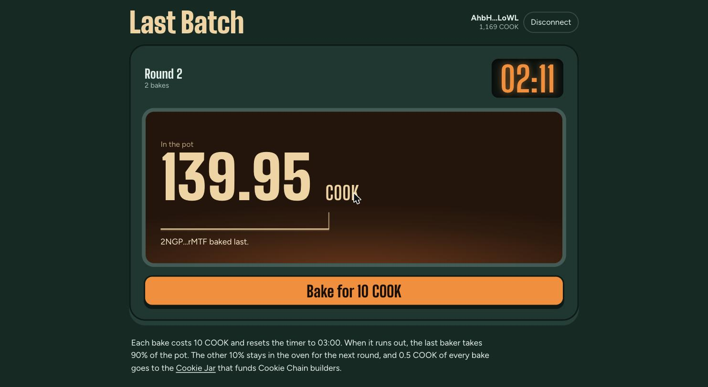

# Last Batch

Bake last, take the pot. Last Batch is an on-chain oven game on [Cookie Chain](https://www.cookiechain.wtf).

Every bake pays a few COOK into a shared pot and resets a countdown. When the countdown reaches zero, the
last person who baked takes the pot. A slice of every bake goes to the
[Cookie Jar](https://docs.cookiechain.wtf/cookie-jar), the community vault that funds Cookie Chain
builders, and part of each pot stays in the oven so the next round never starts empty.



- **Live app:** https://last-batch.vercel.app
- **Program:** [`BakeGjtjwhpaZ8bwqDjGR4KeRZ2jBPLia4XJdbNaJsXP`](https://cookiescan.io/address/BakeGjtjwhpaZ8bwqDjGR4KeRZ2jBPLia4XJdbNaJsXP)
- **Oven account:** [`FLfdfiziHhrjC5n6vyMnegFvscHWgKSUbTdDUPHbXHap`](https://cookiescan.io/address/FLfdfiziHhrjC5n6vyMnegFvscHWgKSUbTdDUPHbXHap)
- **Cookie Jar:** [`568tU9FMksJDxjkLBjWisSA4J4C5uPH87NCCkyREwrxe`](https://cookiescan.io/address/568tU9FMksJDxjkLBjWisSA4J4C5uPH87NCCkyREwrxe)

## Rules

| | |
| --- | --- |
| Bake price | 10 COOK |
| Timer after each bake | 3 minutes |
| Winner's share of the pot | 90% |
| Carried into the next round | 10% |
| Cookie Jar share of every bake | 5% |

The rules are fixed when the oven is created and there is no instruction that changes them or moves
the pot anywhere other than to the last baker.

## Playing

1. Install [Nightly](https://nightly.app) and add Cookie Chain as a custom network:
   RPC `https://rpc.cookiescan.io`, WebSocket `wss://rpc.cookiescan.io`.
2. Get COOK for the bake and fees: bridge it from Solana at
   [hyperlane.cookiescan.io](https://hyperlane.cookiescan.io).
3. Open the app, connect Nightly and press **Bake**. The pot, timer and feed update the moment the
   transaction confirms.
4. When the timer runs out, anyone can press **Pay the winner and bake**: one transaction sends the pot to
   the last baker and starts the next round with your bake.

## How it works

### Program (`programs/last-batch`, Anchor 1.1)

The whole game is one PDA, the **oven** (`seeds = ["oven"]`). It stores the rules, the live round
(pot, last baker, deadline, bake count), totals, and the last 8 bakes and last 8 winners. The pot is
held as lamports in the oven account itself, on top of its rent-exempt balance.

| Instruction | Who | What it does |
| --- | --- | --- |
| `initialize(bake_price, round_secs, jar_bps, carry_bps)` | once | Creates the oven and fixes the rules and the Cookie Jar address. |
| `bake` | anyone | Transfers `jar_bps` of the price to the Cookie Jar and the rest to the pot, makes the caller the last baker and sets `deadline = now + round_secs`. Fails once the deadline has passed. |
| `settle` | anyone | After the deadline, pays `pot − carry` to the last baker, keeps `carry` as the next round's pot and opens the next round. |
| `sweeten(amount)` | anyone | Adds COOK to the pot without touching the timer or the lead. |

Events `Baked`, `Settled` and `Sweetened` are emitted for indexers and explorers.

Safety properties covered by the tests:

- the oven always holds exactly its rent-exempt balance plus the recorded pot;
- `settle` only pays the address stored as last baker (Anchor `address` constraint);
- a bake in the last second counts, a bake one second later is rejected;
- a round without bakes cannot be settled, and a settled round cannot be settled twice;
- the winner can settle and bake the next round in the same transaction;
- all arithmetic is checked, and shares use `u128` intermediates.

### App (`app`, Vite + React)

- **Kit client:** `@solana/kit` with `@solana/kit-plugin-wallet` for Wallet Standard discovery
  (Nightly and other SVM wallets) and `@solana/kit-plugin-rpc` pointed at the Cookie Chain RPC. The
  wallet only signs; simulation, sending and confirmation go through Cookie Chain.
- **Typed client:** generated from the Anchor IDL with Codama (`app/src/generated`).
- **Live data without an indexer:** the app subscribes to the oven account over WebSocket and decodes
  it on every change, with an 8-second poll as a fallback.
- **Chain clock:** the countdown uses the latest block time, so it matches what the program checks even
  when the device clock drifts.
- **Transaction feedback:** each action shows its state (waiting for Nightly, confirmed with time and a
  Cookiescan link) and turns program errors into plain explanations, for example when someone else paid
  the winner a moment earlier.

## Development

Requirements: Rust with the Solana toolchain (Agave 3.1), Anchor CLI 1.1.2, Node 22+ and pnpm.

```bash
# Program: build and run the LiteSVM tests
NO_DNA=1 anchor build
cargo test -p last-batch

# Regenerate the TypeScript client after changing the program
cd app && pnpm install && pnpm codama

# Local chain with the program loaded
solana-test-validator --reset \
  --bpf-program BakeGjtjwhpaZ8bwqDjGR4KeRZ2jBPLia4XJdbNaJsXP target/deploy/last_batch.so

# Create and seed a local oven (any funded keypair works)
pnpm oven init    --rpc http://127.0.0.1:8899 --keypair <keypair.json> --jar <any address>
pnpm oven sweeten --rpc http://127.0.0.1:8899 --keypair <keypair.json> --amount 250

# App against the local chain
VITE_RPC_URL=http://127.0.0.1:8899 VITE_WS_URL=ws://127.0.0.1:8900 pnpm dev
```

`pnpm oven status` reads the live oven on Cookie Chain. Commands that write to Cookie Chain require
`--yes`.

### Deploying to Cookie Chain

```bash
solana program deploy target/deploy/last_batch.so \
  --program-id target/deploy/last_batch-keypair.json \
  --url https://rpc.cookiescan.io --keypair <deployer.json>

cd app
pnpm oven init    --keypair <deployer.json> --yes    # 10 COOK, 180 s, 5% jar, 10% carry
pnpm oven sweeten --keypair <deployer.json> --amount <COOK> --yes
pnpm build        # static site in app/dist
```

## License

MIT
